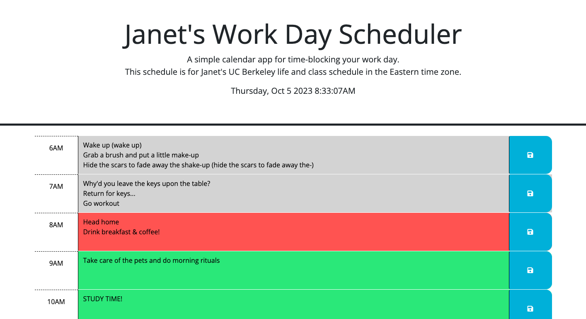
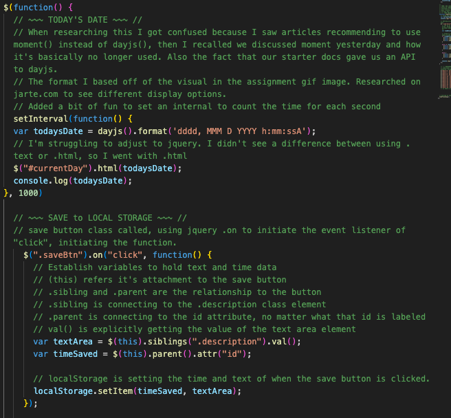
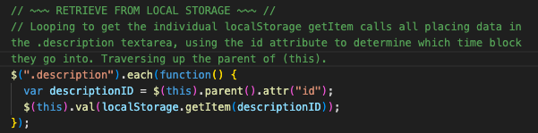
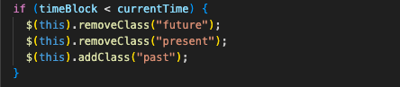
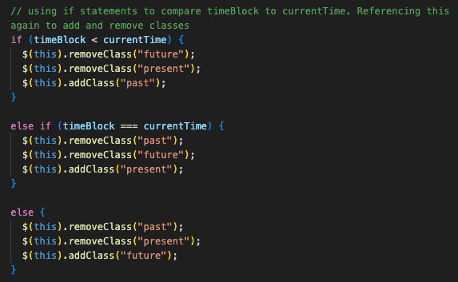

# WORK DAY SCHEDULER
### [View Project Here](https://twixmixyjanet.github.io/work-day-scheduler/ "Time Block App") 

| Technology Used    | Resource URL |
| --------  | ------- |
| HTML      | https://developer.mozilla.org/en-US/docs/Web/HTML |
| CSS       | https://developer.mozilla.org/en-US/docs/Web/CSS |
| JavaScript | https://developer.mozilla.org/en-US/docs/Web/JavaScript |
| jQuery | https://jquery.com/ |
| DayJS | https://day.js.org/ |
| Git       | https://git-scm.com/ |
| GitHub     | https://github.com/ |
| VSCode    | https://code.visualstudio.com/ |

## Table of Contents

* [Description](#description)
* [Installation](#installation)
* [Usage](#usage)
* [Credits](#credits)
* [License](#license)

## Description:
This is a JavaScript focused project with the goal to create a work day scheduler app. Also known as a time blocking app. 
 
How to use this app:

* Place cursor in the text area of the time of day you wish to update
* Type your activities for that time block
* Click the save button
* Repeat as needed
* Track throughout the day to know what you should be doing at that time

#### User Story
- AS AN employee with a busy schedule
- I WANT to add important events to a daily planner
- SO THAT I can manage my time effectively

#### Acceptance Criteria
- GIVEN I am using a daily planner to create a schedule
- WHEN I open the planner
- THEN the current day is displayed at the top of the calendar
- WHEN I scroll down
- THEN I am presented with time blocks for standard business hours of 9am to 5pm
- WHEN I view the time blocks for that day
- THEN each time block is color-coded to indicate whether it is in the past, present, or future
- WHEN I click into a time block
- THEN I can enter an event
- WHEN I click the save button for that time block
- THEN the text for that event is saved in local storage
- WHEN I refresh the page
- THEN the saved events persist

### Lessons Learned

#### 1. jQuery syntax
The biggest issue for me was trying to figure out what the jQuery syntax needed to be. It just isn't as straight forward to me and there's a lot of documenation to review to find out. Even just writing the functions I would first attempt to write it in vanilla JS, but then realize I needed to change it to jQuery. Oftentimes I found myself doing this. The key for me is being explicit with the websites I used to look for answers or including the specific keywords needed when searching for answers, especially when debugging. 

#### 2. dayjs versus momentjs
Thankfully we went over this during the class time lessons. When researching I saw reference of articles using momentjs instead of dayjs. Thankfully the instructors got us sorted.  

#### 3. (this)
I don't think I used (this) previously in vanilla JS, so it took some adjusting to try and determine how to utilize it in jQuery. geeksforgeeks.org gave some good reference material to better understand it.  

#### 4. addClass / removeClass
I did like how much more straight forward, but also very explicit this was than vanilla JS. Combined with (this) it created very simple statements to change classes within the if statement. 

#### Synopsis
I'm so thankful that jQuery was introduced with starter code! It made it so much easier to use the already predefined classes and ids. This way I could just focus on determining what the script needed to be versus anything in the HTML or CSS. I was surprised how much less time this challenge took, even though I was confused by many elements of jQuery. Hopefully it will begin to settle into my brain soon enough!

## Installation

1. Create a new repository on GitHub, to store this project.
2. Clone the repository to your computer.
3. Copy files to your own repository.
4. Make changes to the code.
5. Commit the changes to the local repo.
6. Push the changes to the remote repo.

## Usage

This is a work day scheduler / time blocking app. If you would like to use this app follow the installation steps and curate it to your needs. If you would like to use this app to manage your time blocking activities, follow the steps under the description above and click the link at the top of this page.

## License

MIT License
Copyright (c) 2023 Twixmixy / Janet Webster

## About The Author
### Janet Webster
Full Stack MERN Software Engineer in training.

- [GitHub](https://github.com/TwixmixyJanet/)
- [LinkedIn](https://www.linkedin.com/in/twixmixy/)
- [Twitter](https://twitter.com/Twixmixy)
- [WakaTime](https://wakatime.com/@Twixmixy)

